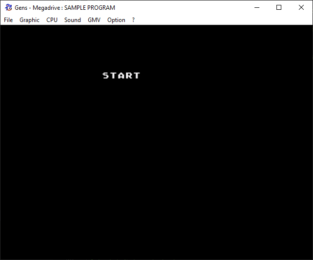

# Controles en Mega Drive

A la hora de trabajar con los controles de mega Drive, hay que tener en cuenta que había varios perifericos especiales para esta videoconsola. Como puede ser un [raton](https://segaretro.org/Sega_Mouse); o tener un adaptador para más de 2 controladores (como podía ser los juegos con formato J-Cart).


Es por ello que necesitamos conocer la manera de poder leer la entrada de los controles para poder hacer que el juego sea más interactivo; en el caso de usar SGDK, podemos hacerlo de forma síncrona o asíncrona. Comenzaremos con la forma Síncrona.

## Controles Síncronos

Como vimos en el apartado del [hola mundo](../../sgdk/hola-mundo/), vamos a crear una nueva carpeta que contenga otra carpeta llamda _src_ y en este caso, otra llamada _inc_; quedando el arbol de ficheros así:

```bash
miproyecto
    |
    ______src/
    ______inc/
```

Una vez creadas las carpetas, crearemos un fichero llamado _main.c_ que deberá estar incluido dentro de la carpeta src. que tendrá el siguiente contenido:

```c
/* Ejemplo 2: Controles. Este ejemplo permite ver como leer de forma sincrona los controles de la megaDrive */
#include <genesis.h>
//Se inclue el fichero de constantes que hemos definido y debe ir en la carpeta inc
#include "constants.h"

//Definicion de la funcion ShowInputStatus; mostrara en pantalla cuando se pulse un boton
void showInputStatus();
//Imprime un caracter en una posicion especifica
void printChar(char *, int, int);

int main()
{
    //Se establece el ancho de pantalla a 320
    VDP_setScreenWidth320();
    //Bucle infinito
    while (1)
    {
        //Se muestra el estado por pantalla
        showInputStatus();
        //Se espera al refresco de pantalla
        VDP_waitVSync();
    }
    return (0);
}

/**
 * Imprime por pantalla un texto en una posicion en Tiles
 * text-> Cadena de texto a imprimir
 * posx-> Posicion X en Tiles (1Tile = 8X8 pixels)
 * posy -> Posicion Y en Tiles (1 Tile = 8x8 Pixels)
 * */
void printChar(char *text, int posx, int posy)
{
    VDP_drawText(text, posx, posy);
}
/**
 * Muestra por pantalla el estado de cada boton pulsado.
 * */
void showInputStatus()
{
    //Se lee el estado del joistick en el puerto 1
    int value = JOY_readJoypad(JOY_1);
    
    if (value & BUTTON_UP)
        printChar(UP_TEXT, POSX_UP, POSY_UP);
    else
        printChar(EMPTY_TEXT, POSX_UP, POSY_UP);

    if (value & BUTTON_LEFT)
        printChar(LEFT_TEXT, POSX_LEFT, POSY_LEFT);
    else
        printChar(EMPTY_TEXT, POSX_LEFT, POSY_LEFT);
    if (value & BUTTON_RIGHT)
        printChar(RIGTH_TEXT, POSX_RIGHT, POSY_RIGHT);
    else
        printChar(EMPTY_TEXT, POSX_RIGHT, POSY_RIGHT);
    if( value & BUTTON_DOWN)
         printChar(DOWN_TEXT, POSX_DOWN, POSY_DOWN);
    else
        printChar(EMPTY_TEXT, POSX_DOWN, POSY_DOWN);

    if (value & BUTTON_A)
        printChar(A_TEXT, POSX_A, POSY_RIGHT);
    else
        printChar(EMPTY_TEXT, POSX_A, POSY_RIGHT);
    
    if(value & BUTTON_B)
        printChar(B_TEXT, POSX_B, POSY_RIGHT);
    else
        printChar(EMPTY_TEXT, POSX_B, POSY_RIGHT);
    
    if(value & BUTTON_C)
        printChar(C_TEXT, POSX_C, POSY_RIGHT);
    else
        printChar(EMPTY_TEXT, POSX_C, POSY_RIGHT);
    
    if(value & BUTTON_START)
        printChar(START_TEXT, POSX_START, POSY_RIGHT);
    else
        printChar(EMPTY_TEXT, POSX_START, POSY_RIGHT);
}
```

Como podéis ver en el ejemplo, nos falta un fichero donde se encuentran todas las constantes que hemos definido; el cual podéis descargar [aquí](../../res/constants.h) y ponerlo en la carpeta _inc_. Una vez los dos ficheros esten listos, podemos compilarlo y ejecutarlo en un emulador o consola.

!!! note
    **Recuerda**: La rom compilada se encuentra en la carpeta _out_ con el nombre _rom.bin_.

Si ejecutamos usando un emulador la rom este sería el aspecto:



## Controles Asincronos

La forma anterior, es quizas menos eficiente ya que debemos esperar a que termine de dibujar toda la pantalla para poder leer de nuevo los controles. Es por ello que se requiere una forma asíncrona que utilice la potencia de las interrupciones para poder ejecutar la lectura de los controles "Cuando sea necesario".

Vamos a crear otro proyecto con la misma estructura anterior; (No olvides incluir el fichero .h). En este caso usaremos el siguiente código fuente en el fichero _main.c_.

!!! note
    **Recuerda**: Todos los ejemplos estaran disponible en el repositorio de este taller.

Seguidamente mostramos el código fuente:

```c
/* Ejemplo 4: Controles Asincronos. Uso de interrupciones para manejar controles.
*/
#include <genesis.h>
//Libreria de constantes
#include "constants.h"
//Manejador de entrada
void inputHandler(u16,u16,u16);
//Imprime un mensaje en pantalla
void printChar(char*, int, int);
//Funcion principal
int main()
{
    //inicializacion del sistema de controles
    JOY_init();
    //Establecemos el manejador de entrada
	JOY_setEventHandler( &inputHandler );
    while(1)
    {
        VDP_waitVSync();
       
    }
    return (0);
}

/**
 * Imprime por pantalla un texto en una posicion en Tiles
 * text-> Cadena de texto a imprimir
 * posx-> Posicion X en Tiles (1Tile = 8X8 pixels)
 * posy -> Posicion Y en Tiles (1 Tile = 8x8 Pixels)
 * */
void printChar(char *text, int posx, int posy)
{
    VDP_drawText(text, posx, posy);
}

/**
 * Manejador de entrada
 * joy-> Indica el mando que ha activado la entrada
 * state -> Indica el estado del mando (boton activado)
 * changed -> indica si ha cambiado (pulsado o solatado)
 * */
void inputHandler(u16 joy, u16 state, u16 changed)
{

    
        if (changed & state & BUTTON_START)
		{
			printChar(START_TEXT, POSX_START, POSY_RIGHT);
		}
		else 
		{
			printChar(EMPTY_TEXT, POSX_START, POSY_RIGHT);	
		}

        if (changed & state & BUTTON_UP)
		{
			printChar(UP_TEXT, POSX_UP, POSY_UP);
		}
		else 
		{
			printChar(EMPTY_TEXT, POSX_UP, POSY_UP);	
		}

        if (changed & state & BUTTON_LEFT)
		{
			printChar(LEFT_TEXT, POSX_LEFT, POSY_LEFT);
		}
		else 
		{
			printChar(EMPTY_TEXT, POSX_LEFT, POSY_LEFT);	
		}

        if (changed & state & BUTTON_DOWN)
		{
			printChar(DOWN_TEXT, POSX_DOWN, POSY_DOWN);
		}
		else 
		{
			printChar(EMPTY_TEXT, POSX_DOWN, POSY_DOWN);	
		}

        if (changed & state & BUTTON_RIGHT)
		{
			printChar(RIGTH_TEXT, POSX_RIGHT, POSY_RIGHT);
		}
		else 
		{
			printChar(EMPTY_TEXT, POSX_RIGHT, POSY_RIGHT);	
		}


        if (changed & state & BUTTON_A)
		{
			printChar(A_TEXT, POSX_A, POSY_RIGHT);
		}
		else 
		{
			printChar(EMPTY_TEXT, POSX_A, POSY_RIGHT);	
		}

        if (changed & state & BUTTON_B)
		{
			printChar(B_TEXT, POSX_B, POSY_RIGHT);
		}
		else 
		{
			printChar(EMPTY_TEXT, POSX_B, POSY_RIGHT);	
		}

        if (changed & state & BUTTON_C)
		{
			printChar(C_TEXT, POSX_C, POSY_RIGHT);
		}
		else 
		{
			printChar(EMPTY_TEXT, POSX_C, POSY_RIGHT);	
		}

}
```