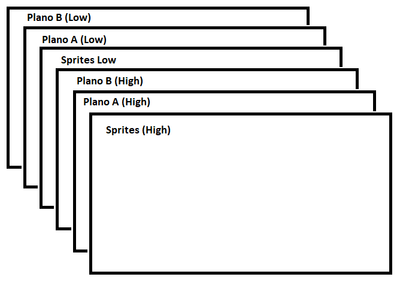
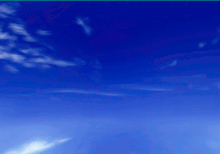
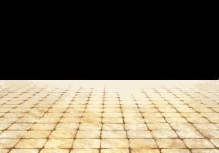

## Planos (Layers)

Uno de los recursos con los que se suele trabajar a la hora de crear videojuegos, son las capas o planos. Con ellos podemos añadir contenido a nuestro juego y dar sensación de profundidad o poder mostrar alguna animación que este ocurriendo en ese momento. En este apartado, como introducción al manejo de recursos con MegaDrive aprenderemos a usar las capas o planos para dar sensación de profundidad a nuestros juegos.

## Imagenes en Mega Drive

En primer lugar, vamos a ver como se manejan imagenes o recursos dentro de la propia Mega Drive. Es impotante tener en cuenta los siguientes conceptos ya que de otra forma no se nos motrarán bien las imagenes o incluso nuestro juego no funcionaría:

* En cada refresco, se pintan 2 planos a la vez ( además de la capa de los sprites)
* Cada plano esta compuesto por Tiles que pueden estar compuestos por distintos tamaños (Por defecto 8x8 pixels).
* Solo se pueden tener 4096 Tiles en memoria.
* cada plano es dibujado de izquierda a derecha y de arriba a abajo.
* Cada plano puede ser dibujado por una de las 4 paletas disponibles.
* El primer Tile es usado para dibujar el fondo.

!!! note
    **Recuerda**: Todos los recursos del juego deben ir en la carpeta _res_.

Para añadir una imagen para cargarla como plano, debemos añadirla a la carpeta de recursos. Seguidamente crear un fichero con extension _.res_; y a continuación añadir el siguiente contenido.

```
IMAGE bga_image "gfx/bgc.bmp" BEST
IMAGE bgb_image "gfx/bgb.bmp" BEST
```

Como podemos ver se trata de un fichero que define cada recurso de la siguiente manera:

* **Tipo de recurso**: En este caso de tipo IMAGE.
* **Nombre del recurso**: Nombre que daremos al recurso
* **Ruta relativa al fichero**: Ruta donde se encuentra el fichero de imagen.
* **Tipo de compresion**: Tipo de compresion que se le puede añadir a la imagen para ser almacenada; en este caso se busca la mejor (BEST).

Una vez añadido el fichero de recursos y si compilamos el proyecto, veremos que se añade en la carpeta _res_ un fichero .h; este fichero .h contiene la referencia a nuestros recursos que podremos añadir a nuestro proyecto. Si por ejemplo hemos creado el fichero _gfx.res_, al compilar obtendremos el fichero _gfx.h_. Después para referenciarlo en nuestro proyecto, lo único que debemos hacer es:

```c
#include "gfx.h"
```

### Paleta de colores

Hemos de tener en cuenta también que las imagenes en Mega Drive no son RGB ya que utilizan una paleta para poder referenciar los colores; en este caso serían imagenes indexadas. Cada paleta solo tiene hasta 16 colores. Esto es importante a la hora de exportar imagenes.

!!! note
    Al tener una paleta de 16 colores, es necesario que el fichero (bmp o png) que contiene la imagen debe tener una profundida de bits de 4 u 8 bpp.

## Planos o capas

Una vez sabemos como añadir recursos de imagen a nuestro poyecto, vamos a mostrar como añadir planos y cargarlos en nuestros juegos para que se muestren. En primer lugar, hay que saber que con SGDK, podemos trabajar con 2 planos a la vez (aunque podemos utilizar un tercer plano usando Sprites).

En primer lugar, hay que saber que al trabajar con paletas es importante saber que se esta cargando correctamente con la paleta que corresponde. SGDK permite trabajar con 4 paletas de 16 colores a la vez. Por lo que es importante saber con que colores estamos trabajando.

Para poder dibujar un plano, se utiliza la siguiente función:

```
VDP_drawImageEx(PLAN_B, &bga_image, TILE_ATTR_FULL(PAL1, FALSE, FALSE, FALSE, ind), 0, 0, FALSE, TRUE);
```

Esta función, tiene los siguientes parametros:

* plano: Indica el plano que dibujara PLAN_A o PLAN_B.
* nombre del recurso: Es el nombre que hemos puesto en el fichero _res_.
* Tile Base: Indica en el Tile donde se dibujara; es por ello que usamos la macro _TILE_ATTR_FULL_.
* Posicion X: Posicion Inicial X donde se dibujara.
* Posicion Y: Posicion Inicial Y donde se dibujara.
* Cargar Paleta: Indica si se debe cargar la paleta de la imagen o no si ya se habia cargado previamente.
* Modo Carga: Indica como se debe cargar, puede ser CPU, DMA o DMA_QUEUE; por defecto es CPU. Si se deja como FALSE se usara la CPU.

!!! note
    La macro ```TILE_ATTR_FULL``` permite definir el Tile base desde el que se dibujara la imagen o plano. En este caso tiene los siguientes parámetros:
    
    * Paleta a utilizar: puede ser _PAL_0_, _PAL_1_, _PAL_2_ o _PAL_3_.
    * Prioridad: indica si el plano tiene prioridad.
    * VFlip: indica si se volteara verticalmente.
    * HFlip: Indica si se volteara horizontalmente.
    * indice: Indica el indice en memoria desde el que se cargara.

Como hemos podido ver a la hora de trabajar con planos, Se pueden trabajar con 2 a la vez; sin embargo, si utilizamos las prioridades y la capa de sprites, esto se puede ampliar. Vamos a mostrar un esquema para ver la prioridad y como se dibujan los planos; pudiendo jugar con la transparencia y por ello hacer la sensación de profundidad.



## Ejemplo con Planos

Una vez que hemos visto como manejar los planos y como se dibujan en la Mega Drive, pasaremos a ver un ejemplo usando dos imagenes para dar una sensación de profundidad. Una aparecerá un terreno por donde se puede avanzar y otro será el cielo que se mostrará de fondo. Dejamos aquí las dos imagenes y la correspondiente descarga de la misma con 4bpp de profundidad.




[Enlace de descarga de las imagenes](../res/images.zip)

Una vez descargadas las imagenes y creado un nuevo proyecto, podemos pasar a añadir estas a la carpeta _res_; para una mejor organización añadiremos dentro de esta una carpeta llamda _gfx_. En la cual añadiremos las 2 imagenes.

Una vez añadidas las imagenes, crearemos el fichero _gfx.res_ dentro de la carpeta res; con el siguiente contenido:

```
IMAGE bga_image "gfx/bgc.bmp" BEST
IMAGE bgb_image "gfx/bgb.bmp" BEST
```

Tras terminar esto, compilaremos el proyecto y veremos como se genera un fichero llamado _gfx.h_ dentro de la carpeta res. Una vez hecho esto, crearemos el fichero _main.c_ en  la carpeta src, con el siguiente contenido:

```c
/** Ejemplo5: Ejemplo de planos con Mega Drive **/
//Incluir libreria
#include <genesis.h>

// Incluir los recursos
#include "gfx.h"
//Funcion Principal
int main()
{
    //array donde se almacenara las paletas
    u16 palette[32];
   //Para evitar problemas, se deshabilitan las interrupciones durante la carga
    SYS_disableInts();
    // initializacion a 320 de ancho
    VDP_setScreenWidth320();
     // se establecen los colores de la paleta a negro
    VDP_setPaletteColors(0, (u16*) palette_black, 32);

    //Indice para pdoer saber la carga
    u16 ind = TILE_USERINDEX;

    //dibuja un plano a partir de un recurso
    VDP_drawImageEx(PLAN_B, &bga_image, TILE_ATTR_FULL(PAL1, FALSE, FALSE, FALSE, ind), 0, 0, FALSE, TRUE);
    ind += bga_image.tileset->numTile;
    VDP_drawImageEx(PLAN_A, &bgb_image, TILE_ATTR_FULL(PAL0, FALSE, FALSE, FALSE, ind), 0, 0, FALSE, TRUE);
    ind += bgb_image.tileset->numTile;
    
    
   
     //Se vuelven a activar las interrupciones
    SYS_enableInts();

    // prepare palettes
    memcpy(&palette[0], bgb_image.palette->data, 16 * 2);
    memcpy(&palette[16], bga_image.palette->data, 16 * 2);
     // fade in
    VDP_fadeIn(0, (2 * 16) - 1, palette, 20, FALSE);
    // bucle infinito
    while(1)
    {
        //Esperar refresco
        VDP_waitVSync();
    }
}
```

Una vez compilado el proyecto, si lo ejecutamos en un emulador saldrá más o menos así:

