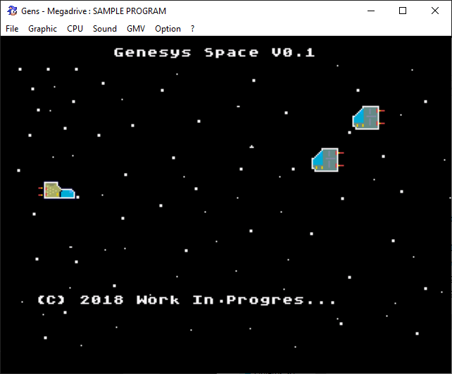

# Gens

Para poder probar nuestros juegos y ver como funciona, vamos a instalar el emulador [Gens](http://www.gens.me/); el cual podremos instalar la versión modificada con KMod (Solo Windows).



Seguidamente mostraremos como instalar este emulador en distintos sistemas Operativos:

## Windows

Descargar el siguiente [Zip](../res/gens2.12kmod.zip) y descomprimirlo en tu ordenador.

### KMod (Solo Windows)

La versión de windows instalada tiene una versión modificada que nos permitirá ver información de la Mega Drive; de forma que nos ayude a depurar nuestros juegos.

Para ver este menú especial, podemos ir al menú CPU->debug->Genesis, para ver distintas opciones.


## Linux

Descargar el fichero .deb (Para sistemas basados en Debian) o .rpm (Sistemas RH) del siguiente [enlace](https://sourceforge.net/projects/gens/files/Gens%20for%20Linux/Gens%202.15.5/); e instalar en tu sistema usando el gestor de paquetes necesario.

!!! note
    Esta version requiere que se tenga activado la gestión de depedencias con arquitectura i386 por lo que requerirá ejecutar el siguiente comando ```dpkg --add-architecture i386```.

## MacOs (wine)

Si ha instalado SGDK usando el método con Wine, puede instalar GensK (versión con KMod) descargandolo desde la siguiente [página](https://gendev.spritesmind.net/page-gensK.html ). Una vez descargado y descomprimido, realizaremos los siguientes pasos:

```bash
mkdir $GENDEV/gens
mv <carpetadondeseencuentregensk>/* $GENDEV/gens
ln -sv $GENDEV/gens $GENDEV/wine/drive_C/gens
```